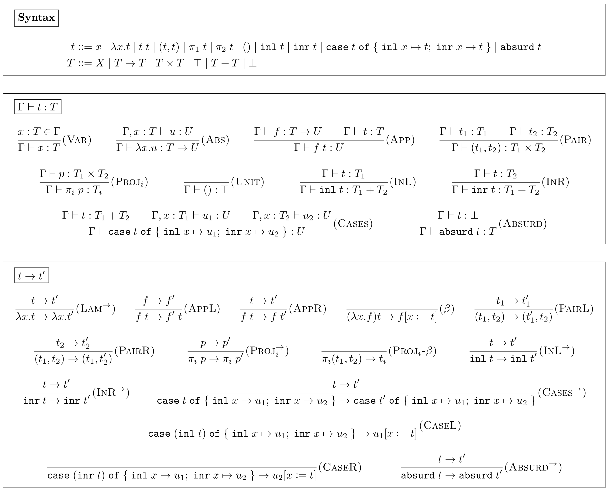

# Бонусное задание по Twelf

В этом бонусном домашнем задании предлагается попрактиковаться со средой
доказательств [Twelf](https://twelf.org/).

## Формат сдачи

Решение принимается в виде self-contained репозитория на GitHub,
собирающего и проверяющего Ваше решение с помощью GitHub Actions.

## Оценивание

- [ ] **2 балла** за настройку CI, собирающего Twelf из исходников
      и запускающего проверку репозитория;
- [ ] **8 баллов** за формализацию в Twelf системы типов, описанной ниже.

Обратите внимание, что для получения полного балла за CI в репозитории должны
содержаться _только_ исходные файлы Вашего проекта и скрипты GitHub Actions:
ни бинарных файлов SML/NJ и Twelf, ни исходного кода SML/NJ и Twelf
в репозитории быть не должно.

## Требуемая система типов

В рамках данного домашнего задания предлагается формализовать **просто
типизированное лямбда-исчисление с типами-произведениями и типами-суммами**. На
всякий случай напомним, как мы задали эту систему в Теоретическом домашнем
задании 3:

- [ ] Выпишите грамматику термов языка (1 б).
- [ ] Выпишите правила типизации термов (1 б).
- [ ] Выпишите операционную семантику языка (1 б).
- [ ] Докажите теорему о сохранении типизации так, чтобы
      из успешной типизации проекта тайпчекером Twelf
      следовала корректность Вашего доказательства (2 б).
- [ ] Аналогичным образом докажите progress-теорему (3 б).
